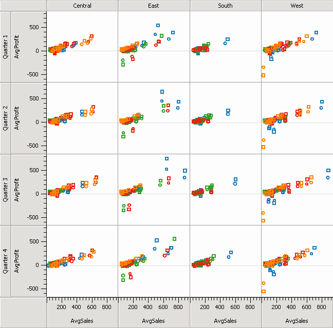
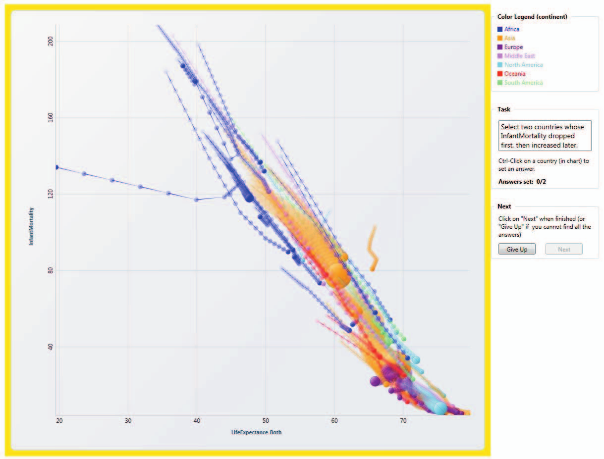
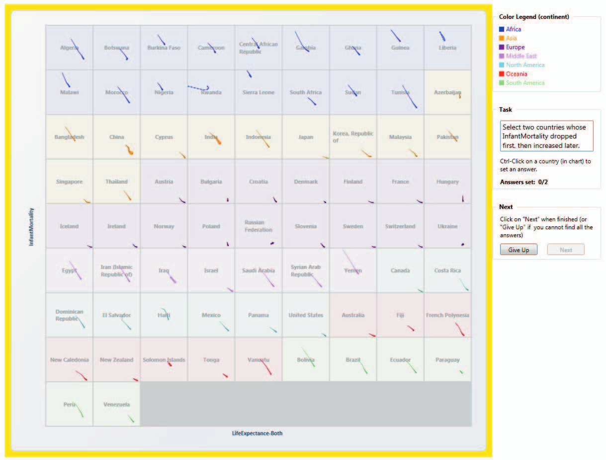
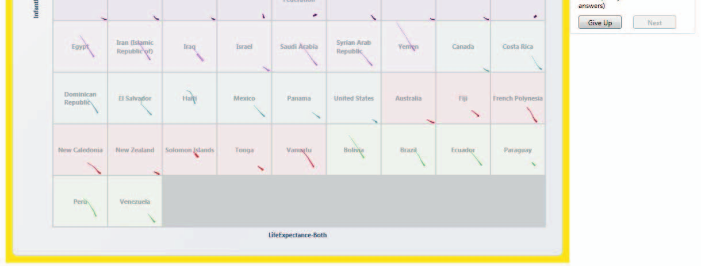
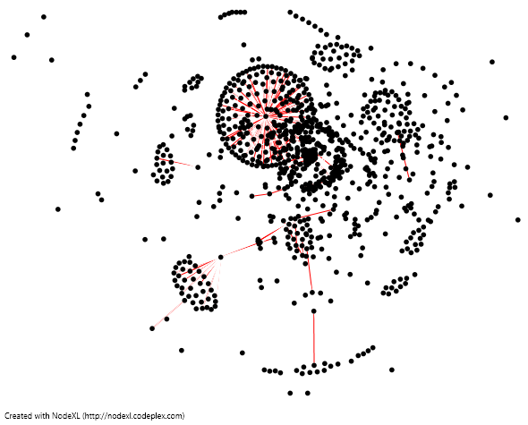
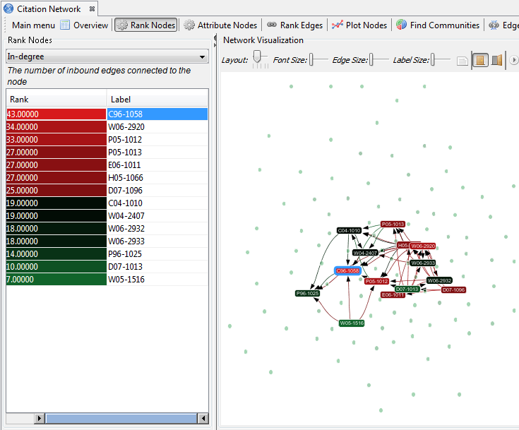

# Visual Analytics #

----

# Visual Analytics #

 - [Mike Doherty](http://mikedoherty.ca)
 - Cong Chen

## Visualizing large data sets ##

Combines several areas of research:

 - Computer science
 - Design
 - Cognitive science
 - Domain expertise

The goal is to generate knowledge from data by using visualization techniques
and automated analysis techniques together.

----

# Challenges in visual analytics #

The challenges in this field vary greatly according to the data being used.

Some examples:

 - Presenting multiple "axes" of data simultaneously
    - VizQL
 - Presenting a useful visualization to the user (depends on data type)
 - Providing a useful interface for exploration of the dataset
    - Gapminder/Trendalyzer
 - Processing data fast enough for real-time interaction
 - Measuring success of a visual analytics tool
    - Action Science Explorer

----

# Examples #

1. VizQL
2. GapMinder/Trendalyzer
3. NetEvViz
4. Action Science Explorer

----

# VizQL #

Visual Query Language

----

# VizQL #

    SELECT AS SHAPE
        Market * AVG(Sales)     ON COLS
        Quarter * AVG(Profit)   ON ROWS
        State * Product         IN PANES
        ProductType             ON COLOR
        Year                    ON SHAPE
    FROM database

----

# GapMinder/Trendalyzer #

This is a visualization tool created by Hans Rosling and his team.

<video src="videos/Hans.ogv" height="70%" controls>Error with HTML5 video support</video>

----

# Are animations effective? #

## Lodha *et al* ##

 - Gapminder is something like correlation or bivariate regression
 - Compare with standard statistical techniques
 - Multiple techniques converging provides additional confidence
 - Notable limitation: aggregate national data hide inequalities internal to a country
    - Gapminder can now split countries into income quintiles or provinces, where such data exists

----

# Are animations effective? #

## Robertson *et al* ##

 - Proposes two alternatives to Gapminder-style animations:
    1. Overlay all trends statically;
    2. Use multiple small panes to show trends side-by-side.

----

# Overlay all trends #

----

# Multiple small panes #

----

# Are animations effective? #

## Robertson *et al* ##

Results:

 - Animation is the worst for real analysis
 - Both alternatives are significantly faster
 - Multiple small panes is more accurate

----

# NetEvViz #

Visualization tool for exploring dynamic social networks

 - Tries to address the problem of multiple axes of data incl. temporal
    - Each vertex is a user; each edge is a relationship
    - Start-time: vertex enters network (profile creation)
    - End-time: vertex exits network (profile deletion)
    - Start/end times of an edge represent the time two users were "friends"
 - User specifies two timestamps
 - Vertices & edges are grouped by temporal attributes
 - Groups are coloured differently, revealing changes in the graph over time

----

# NetEvViz #

"What are the conversations that were alive for 5 days or more?"

----

# Action Science Explorer #

 - [Visualizing scientific literature](images/sci-lit.png)

----

# Less academic examples #

## [David McCandless](http://informationisbeautiful.net/) ##

 - [Mountains out of Molehills](http://www.informationisbeautiful.net/play/mountains-out-of-molehills/),
    a timeline of global media scare stories
 - [Snake oil?](http://www.informationisbeautiful.net/play/snake-oil-supplements/),
    Scientific evidence for popular health supplements
 - [Visualising blood tests](http://www.informationisbeautiful.net/2010/visualizing-bloodtests/)

## [Jonathan Harris](http://www.number27.org/) ##

 - [We Feel Fine](http://www.wefeelfine.org/), an exploration of human emotion on a global scale

----

# References #

1.  [Khurana](papers/Khurana, 2011.pdf), U., Nguyen, V., Cheng, H., Ahn, J., Chen, X., Shneiderman, B. (June 2011).
    *"Visual Analysis of Temporal Trends in Social Networks Using Edge Color Coding and Metric Timelines"*.
    To appear in Proceedings IEEE Conference on Social Computing 2011 (October 2011, Boston, MA), IEEE Press, Piscataway, NJ.
2.  [Gove](papers/Gove, 2011.pdf), R., Dunne, C., Shneiderman, B., Klavans, J., Dorr, B. (January 2011).
    *"Evaluating Visual and Statistical Exploration of Scientific Literature Networks"*.
    To appear in proceedings of 2011 IEEE Symposium on Visual Languages and Human-Centric Computing, (VL/HCC'11).
3.  [Dunne](papers/Dunne, 2011.pdf), C., Shneiderman, B., Gove, R., Klavans, J., Dorr, B. (July 2011).
    *"Rapid Understanding of Scientific Paper Collections: Integrating Statistics, Text Analysis, and Visualization"*.
4.  [Lodha](papers/Lodha, 2009.pdf), S., Gunawardane, P., Middleton, E., Crow, B. (2009).
    *"Understanding Relationships Between Global Health Indicators via Visualisation and Statistical Analysis"*.
    Journal of International Development (21), pp. 1152-1166.
5.  [Robertson](papers/Robertson, 2008.pdf), G., Fernandez, R., Fisher, D., Lee, B., John S. (Nov/Dec 2008).
    *"Effectiveness of Animation in Trend Visualization"*.
    IEEE Transactions on Visualization and Computer Graphics, pp. 1325-1332.

----

# Thanks for listening #

